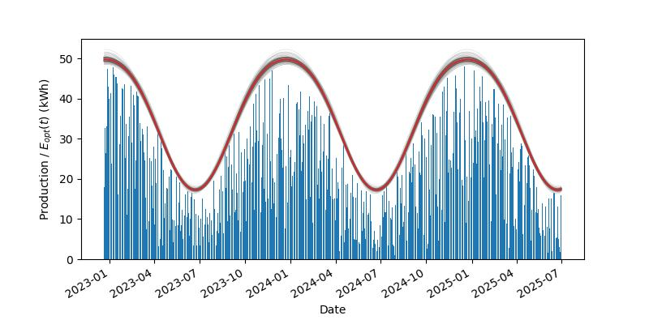
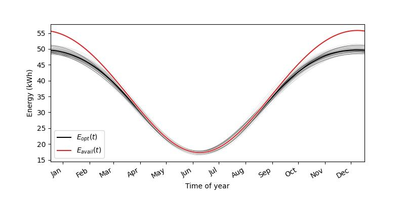
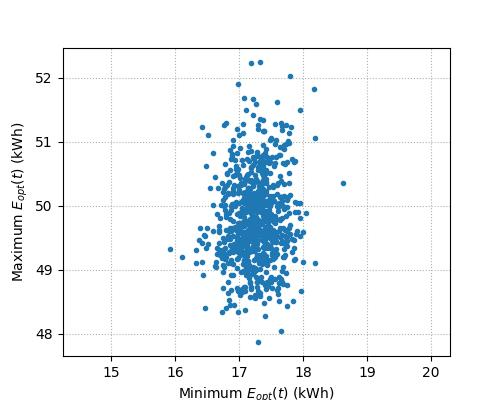
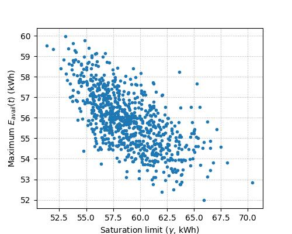
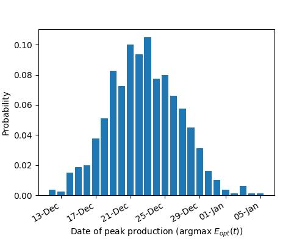
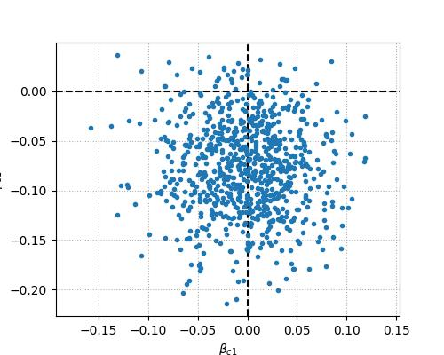
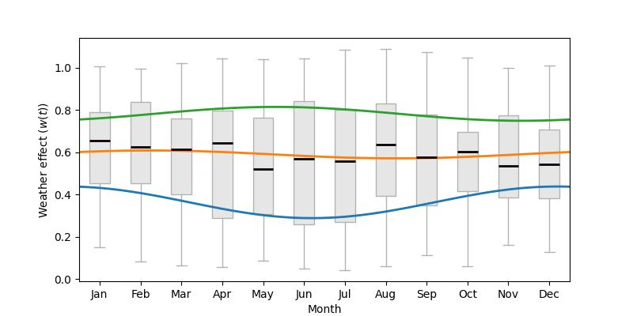
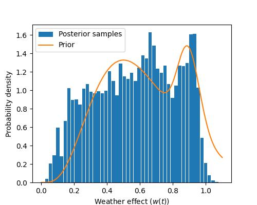
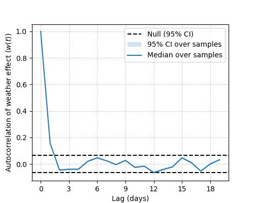

# Solar Analyses

This repository contains an analysis of the energy production of an installed
solar system. A probabilistic model for energy output is inverted using
[(Py)Stan](https://mc-stan.org/).

All figures are clickable links to higher quality versions.

### System details

 + 16 x Hyundai HiE-S400VG panels (400W).
 + Fronius Primo GEN24 5.0 Inverter (5kW).
   Connected as two strings: one for the 4 east facing panels, and the other
   for the 12 north facing panels (wired as two parallel sets of 6 panels).
 + Fronius Ohmpilot (connected to 3kW element).
 + Installed in Dunedin, NZ.

### Raw data

The monthly outputs (as compared to the predictions as quoted) are tabulated
below, as well as a plot of the recorded daily output.

| Month   |   Predicted (kWh) |   Min (kWh) |   Mean (kWh) |   Max (kWh) |
|:--------|------------------:|------------:|-------------:|------------:|
| Jan     |               805 |         927 |         1011 |        1058 |
| Feb     |               731 |         780 |          838 |         868 |
| Mar     |               568 |         699 |          712 |         729 |
| Apr     |               401 |         472 |          511 |         535 |
| May     |               251 |         355 |          363 |         368 |
| Jun     |               183 |         266 |          283 |         311 |
| Jul     |               238 |         311 |          319 |         327 |
| Aug     |               330 |         473 |          502 |         530 |
| Sep     |               516 |         599 |          611 |         623 |
| Oct     |               687 |         727 |          782 |         837 |
| Nov     |               827 |         836 |          864 |         892 |
| Dec     |               786 |         877 |          883 |         889 |

---------

**Figure**: Recorded energy production over the life of the system.

---------

### Model

The model assumes that the maximum available energy generation varies
sinusoidally over the course of the year, with each day's realised production
being a random fraction of this (i.e. dependent on the weather). The below is a
sketch of the key components of the model:

 + Instantaneous phase: $\phi(t) = 2 \pi p(t) + \delta$, where $p(t)$
   represents the proportion of the current year that has passed and the phase
   $\delta$ represents the offset between the start of the year and the date of
   peak energy generation.

 + Seasonal oscillation:
   $s(t) = (\cos(\phi(t) + \beta_{c1}\cos(\phi(t)) + \beta_{s1}\sin(\phi(t))) + 1) / 2$.
   This is a dimensionless representation of the fluctuation in available
   energy over the year. The sinusoidal basis and $\beta$ terms allow the shape
   of the underlying sinusoidal oscillation to be tweaked.

 + Available energy: $E_{avail}(t) = a + b s(t)$ where $a$ represents the
   maximum possible energy production from the panels on the shortest day of
   the year, and $b$ represents the amplitude of the seasonal oscillation in
   kWh. The maximum achievable production will be less than this due to the
   limit to the power output from the inverter.

 + Weather effect: $w(t)$ represents the proportion of the theoretical optimal
   available energy that actually reaches the panels. This takes a prior which
   is a mixture of gamma distributions, to capture clear sunny days separately
   from those with cloud cover.

 + Realised production: $E(t) = \mathop{\text{sat}}(w(t) E_{avail}(t))$. The
   actual amount of energy generated is lower than the theoretical limit due to
   both the weather effect and the inverter clipping power output. The latter
   is modelled as
   $\mathop{\text{sat}}(e) = (-1 / \tau) \mathop{\text{LSE}}(- \tau e, - \tau \gamma)$
   where the LogSumExp function is used as a softmin of the incident energy and
   a hard upper limit on production $\gamma$. The sharpness of the transition
   between the linear and saturating regimes is governed by $\tau$.

 + Optimal production: $E_{opt}(t) = \mathop{\text{sat}}(E_{avail}(t))$
   is a convenience representation of the above. It illustrates what production
   would be achievable per day without weather effects.

The plots below show the distributions over the key parameters.

---------

**Figure**: Distribution of the theoretical maximum daily energy production
($`E_{opt}(t)`$) over the life of the system, plotted against the actual
production.

---------

**Figure**: Annual variation in available energy. This illustrates the
fluctuation in the theoretical limits to production over the year.

---------

**Figure**: Parameters controlling the optimal production curve
($`E_{opt}(t)`$).
**Top Left**: Posterior distribution over the maximum and minimum
of the optimal production curve ($`E_{opt}(t)`$).
**Top Right**: Posterior distribution over the saturation limit
($`\gamma`$) showing its correlation with the maximum available energy
($`a + b`$).
**Bottom Left**: Posterior distribution of the day of the year for which the
theoretical maximum daily energy production peaks ($`\arg\max(E_{opt}(t))`$).
**Bottom Right**: Posterior distribution of the $\beta$ terms that modulate the
shape of the sinusoid that the seasonal oscillation ($`s(t)`$) curve is based
on.

---------

**Figure**: Impact of the weather effect ($`w(t)`$) on production over the life
of the system.

---------

**Figure**: Structure of the posterior over the weather effect terms.
**Top**: Posterior distribution of the weather effect ($`w(t)`$) aggregated by
month. The sinusoidal best fit to the median, and first and third quartiles, is
shown to highlight any seasonal fluctuations.
**Bottom left**: Marginal posterior distribution of the weather effect
($`w(t)`$) plotted against its prior.
**Bottom right**: Autocorrelation of the posterior weather effect parameters
($`w(t)`$) over time.

---------
