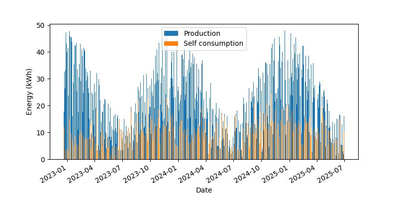
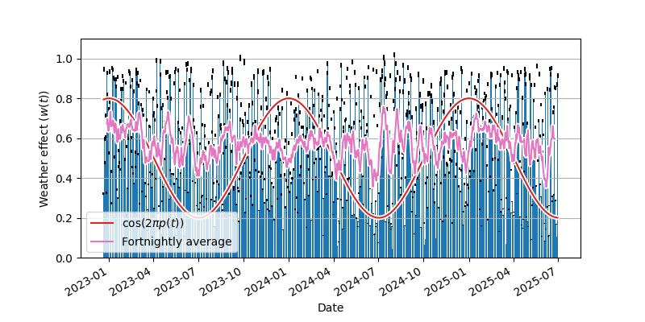

# Solar Analyses

This repository contains an analysis of the energy production of an installed
solar system. A probabilistic model for energy output is inverted using
[(Py)Stan](https://mc-stan.org/).

All figures are clickable links to higher quality versions.

### System details

 + 16 x Hyundai HiE-S400VG panels (400W).
 + Fronius Primo GEN24 5.0 Inverter (5kW).
 + Fronius Ohmpilot (connected to 3kW element).
 + Installed in Dunedin, NZ.

---------

**Figure**: Recorded energy production over the life of the system.

---------

### Model

The model assumes that the maximum available energy generation varies
sinusoidally over the course of the year, with each day's realised production
being a random fraction of this (i.e. dependent on the weather). The below is a
sketch of the key components of the model:

 + Instantaneous phase: $\phi(t) = 2 \pi p(t) + \delta$, where $p(t)$
   represents the proportion of the current year that has passed and the phase
   $\delta$ represents the offset between the start of the year and the date of
   peak energy generation.

 + Seasonal oscillation: $s(t) = \tanh(\gamma (\cos(\phi(t) +
   \beta_{c1}\cos(\phi(t)) + \beta_{s1}\sin(\phi(t))) + 1) / 2)$. This
   represents the fluctuation in energy generation over the year, with the
   $\tanh$ term capturing the way that the limit to the inverter output causes
   this to saturate over the summer. The $\gamma$ parameter controls the
   strength of this saturation. Furthermore, the sinusoidal basis and $\beta$
   terms allow the shape of the underlying sinusoidal oscillation to be
   tweaked.

 + Optimal production: $E_{opt}(t) = a + b s(t)$ where $a$ represents the
   maximum possible production on the shortest day of the year, and $b$
   represents the amplitude of the seasonal oscillation in kWh.

 + Weather effect: The proportion of the theoretical optimal production that is
   actually achieved, $E(t) / E_{opt}(t)$. This takes a prior which is a
   mixture of beta distributions, to capture clear sunny days separately from
   those with cloud cover.

The plots below show the distributions over the key parameters.

---------

**Figure**: Distribution of the theoretical maximum daily energy production
( $E_{opt}(t)$ ) over the life of the system, plotted against the actual
production.

---------

**Figure**: Proportion of the theoretical maximum daily energy production
( $E(t) / E_{opt}(t)$ ) actually achieved over the life of the system, and the
marginal distribution of this plotted against its prior.

---------
